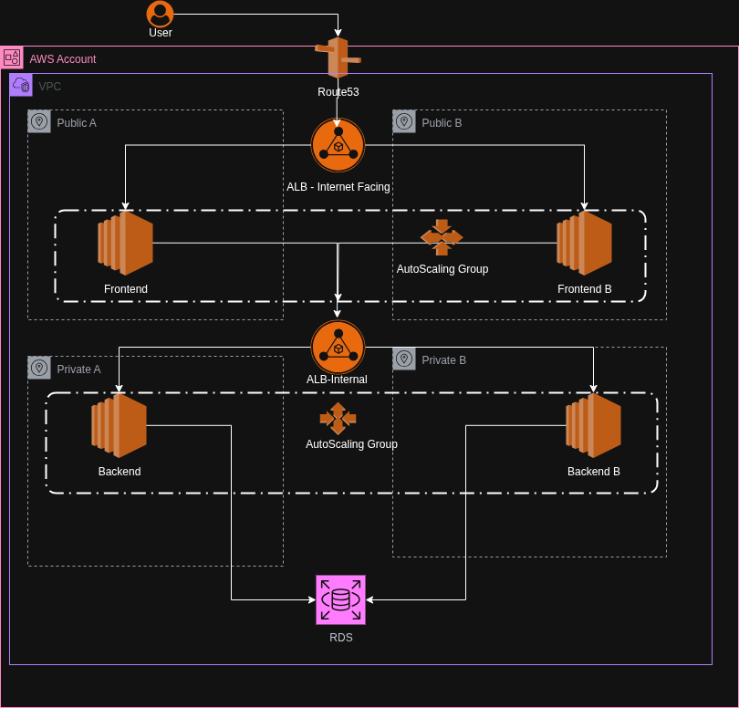

# AWS 3-Tier Application Server - CloudFormation

A complete 3-tier web application infrastructure deployed on AWS using CloudFormation templates and automated via GitHub Actions. This project demonstrates modern cloud architecture patterns with proper separation of concerns, security, and scalability.

## 🏗️ High Level Architecture



*The diagram above shows the complete 3-tier architecture with VPC, subnets, load balancers, EC2 instances, and RDS database components.*

## 📋 Architecture Overview

```
Internet
    ↓
External ALB (WebALB)
    ↓
Web Tier (Apache + Proxy)
    ↓
Internal ALB (AppALB) 
    ↓
App Tier (Flask Backend)
    ↓
RDS MySQL Database
```

**Network Segmentation:**
- **Public Subnets**: External ALB, NAT Gateway
- **Private Subnets**: Web & App Tier instances
- **DB Subnets**: RDS MySQL (isolated)

**Security:**
- Security Groups for each tier
- No direct internet access to backend
- Database isolated in private subnets
- SSH access via key pair

## 🚀 Automated Deployment

This repository includes a GitHub Actions workflow that automatically deploys the 3-tier AWS infrastructure using CloudFormation stacks.

### Prerequisites

1. **AWS Account** with appropriate permissions
2. **GitHub Secrets** configured in your repository
3. **SSH Key Pair** named `sshbastion` in your AWS account

### Required GitHub Secrets

Configure these secrets in your GitHub repository settings:

```
AWS_ACCESS_KEY_ID     = Your AWS Access Key ID
AWS_SECRET_ACCESS_KEY = Your AWS Secret Access Key
```

**To add secrets:**
1. Go to your GitHub repository
2. Click **Settings** → **Secrets and variables** → **Actions**
3. Click **New repository secret**
4. Add both secrets above

### Deployment Triggers

The workflow automatically deploys when:

- **Push to main branch** - Full deployment
- **Push to develop branch** - Full deployment
- **Pull Request to main** - Validation only
- **Manual trigger** - Use GitHub Actions tab

### Deployment Process

The workflow deploys stacks in the following order:

```
1. 🌐 Network Stack
   ├── VPC (10.0.0.0/16)
   ├── 6 Subnets (Public, Private, DB)
   ├── Internet Gateway
   ├── NAT Gateway
   └── Route Tables

2. 🗄️ Database Stack
   ├── RDS MySQL (db.t3.micro)
   ├── DB Subnet Group
   └── Security Groups

3. ⚖️ ALB Stack
   ├── External ALB (Internet-facing)
   ├── Internal ALB (Private)
   ├── Target Groups
   └── Listeners

4. 🖥️ App Tier Stack
   ├── Auto Scaling Group (2 instances)
   ├── Flask Backend (Port 5000)
   ├── Launch Template
   └── CORS Support

5. 🌐 Web Tier Stack
   ├── Auto Scaling Group (2 instances)
   ├── Apache Frontend
   ├── Proxy Script
   └── Launch Template
```

### Manual Deployment

You can also deploy manually using the same commands:

```bash
# 1. Deploy Network Stack
aws cloudformation deploy \
  --template-file cfn-templates/network-stack.yaml \
  --stack-name network-stack \
  --capabilities CAPABILITY_NAMED_IAM

# 2. Get Network outputs and deploy DB Stack
VPC_ID=$(aws cloudformation describe-stacks --stack-name network-stack --query 'Stacks[0].Outputs[?OutputKey==`VpcId`].OutputValue' --output text)
DB_SUBNET_1=$(aws cloudformation describe-stacks --stack-name network-stack --query 'Stacks[0].Outputs[?OutputKey==`DBSubnet1`].OutputValue' --output text)
DB_SUBNET_2=$(aws cloudformation describe-stacks --stack-name network-stack --query 'Stacks[0].Outputs[?OutputKey==`DBSubnet2`].OutputValue' --output text)

aws cloudformation deploy \
  --template-file cfn-templates/db-stack.yaml \
  --stack-name db-stack \
  --capabilities CAPABILITY_NAMED_IAM \
  --parameter-overrides \
    VpcId=$VPC_ID \
    Subnet1=$DB_SUBNET_1 \
    Subnet2=$DB_SUBNET_2

# Continue with ALB, App Tier, and Web Tier stacks...
```

## 🔧 Configuration

### Key Pair

The workflow uses an SSH key pair named `sshbastion`. Make sure this exists in your AWS account:

```bash
# Create key pair if it doesn't exist
aws ec2 create-key-pair --key-name sshbastion --output text --query 'KeyMaterial' > sshbastion.pem
chmod 400 sshbastion.pem
```

### Region

Default region is `ap-southeast-2`. To change:

1. Update the `AWS_REGION` environment variable in `.github/workflows/deploy.yml`
2. Update any hardcoded region references in the templates

### Instance Types

Current configuration:
- **Web Tier**: t3.micro
- **App Tier**: t3.micro  
- **Database**: db.t3.micro

To modify, update the respective CloudFormation templates.

## 📊 Monitoring Deployment

### GitHub Actions

1. Go to **Actions** tab in your GitHub repository
2. Click on the latest workflow run
3. Monitor each step's progress
4. View logs for debugging

### AWS Console

Monitor deployment progress in:
- **CloudFormation** → Stacks
- **EC2** → Instances
- **RDS** → Databases
- **Load Balancers**

## 🧪 Testing

After deployment completes, the workflow outputs the application URL:

```
🌐 Web Application URL: http://WebALB-xxxxxxxxxx.ap-southeast-2.elb.amazonaws.com
```

**Test the application:**
1. Open the URL in your browser
2. You should see "Frontend (Web Tier)"
3. The backend response should show "Backend is working!"

## 🧹 Cleanup

### Automatic Cleanup

The workflow includes a cleanup job that can be triggered manually:

1. Go to **Actions** tab
2. Click **Deploy 3-Tier AWS Infrastructure**
3. Click **Run workflow**
4. Set cleanup parameter to `true`

### Manual Cleanup

Delete stacks in reverse order:

```bash
aws cloudformation delete-stack --stack-name web-tier-stack
aws cloudformation delete-stack --stack-name app-tier-stack
aws cloudformation delete-stack --stack-name alb-stack
aws cloudformation delete-stack --stack-name db-stack
aws cloudformation delete-stack --stack-name network-stack
```

## 🚨 Troubleshooting

### Common Issues

1. **Key Pair Not Found**
   - Ensure `sshbastion` key pair exists in the target region

2. **Insufficient Permissions**
   - Verify AWS credentials have required permissions for EC2, RDS, ELB, CloudFormation

3. **Resource Limits**
   - Check AWS service limits (VPCs, instances, etc.)

4. **Template Validation Errors**
   - Review CloudFormation template syntax
   - Check parameter types and constraints

### Debugging

1. **Check GitHub Actions logs** for detailed error messages
2. **Review CloudFormation events** in AWS Console
3. **Verify AWS credentials** and permissions
4. **Check resource quotas** in AWS Service Quotas

## 📁 Project Structure

```
AWS-3Tier-AppServer-CloudFormation/
├── .github/workflows/
│   └── deploy.yml                 # GitHub Actions workflow
├── app/
│   ├── backend/
│   │   └── app.py                 # Flask backend application
│   └── frontend/
│       └── index.html             # Frontend HTML
├── cfn-templates/
│   ├── network-stack.yaml         # VPC, subnets, routing
│   ├── db-stack.yaml              # RDS MySQL database
│   ├── alb-stack.yaml             # Load balancers
│   ├── app-tier-stack.yaml        # Backend instances
│   ├── web-tier-stack.yaml        # Frontend instances
│   └── root-stack.yaml            # Master template (optional)
└── README.md                      # This file
```

## 🔍 Technical Details

### Frontend (Web Tier)
- **Apache HTTP Server** serving static content
- **Python proxy script** for backend communication
- **Auto Scaling Group** with 2 instances
- **Public subnets** with internet access

### Backend (App Tier)
- **Flask application** with CORS support
- **Auto Scaling Group** with 2 instances
- **Private subnets** with NAT Gateway access
- **Internal load balancer** for distribution

### Database (DB Tier)
- **RDS MySQL 8.0** database
- **Multi-AZ deployment** option
- **Private DB subnets** for isolation
- **Security groups** for access control

### Networking
- **VPC** with 10.0.0.0/16 CIDR
- **6 subnets** across 2 availability zones
- **Internet Gateway** for public access
- **NAT Gateway** for private subnet internet access
- **Route tables** for traffic routing

This automated deployment ensures consistent, repeatable infrastructure deployments with proper dependency management and error handling.